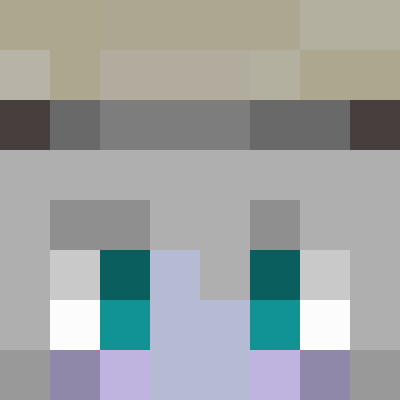

<header>
  <h1>HOME</h1>
  <h2>CONTACT</h2>
  

    

      
<h3>Twitter(GAME)</h3>

      <a href="https://twitter.com/c6cl_">
<h3>Twitter(GAME)</h3>
</a>
      <a href="https://twitter.com/COOK_iE_">
<h3>Twitter(Music)</h3>
</a>
    

  

  <h2>GAMES</h2>
  

    

      

      

      

      

      

    

  

</header>
